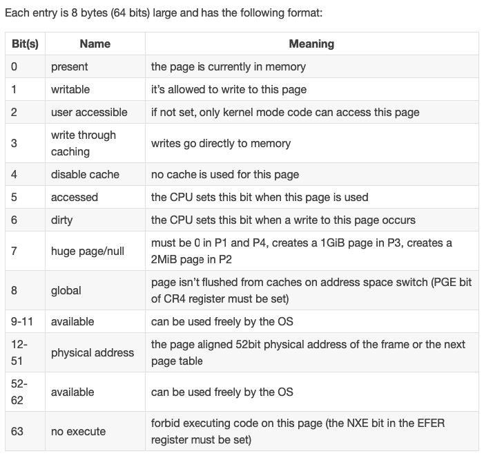
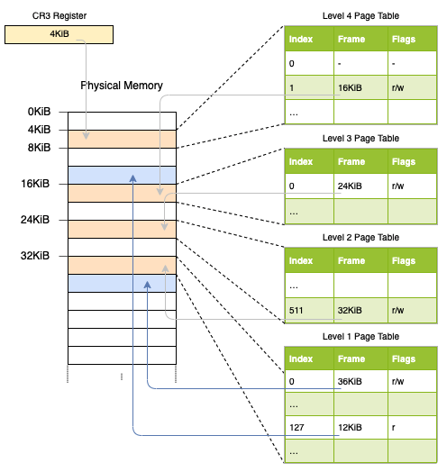
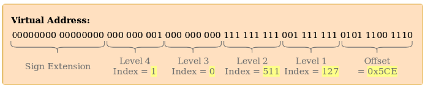
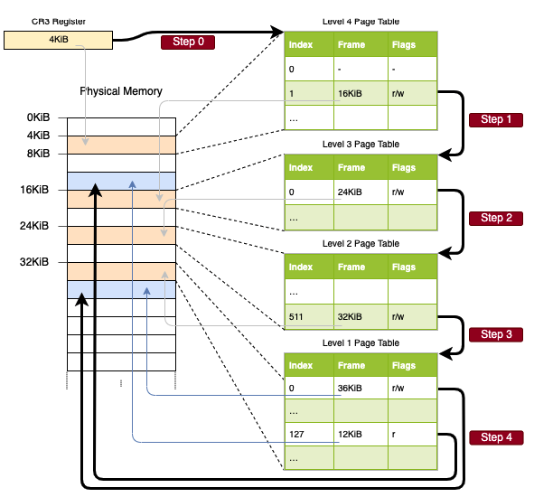

# Introduction to Paging

https://os.phil-opp.com/paging-introduction/

OS 要保证进程的内存空间隔离

## Segmentation

Segmentation uses an individual segment selector register for each active memory region

- Protect mode

  segment descriptors contain an index into a local or global descriptor table, which contains – in addition to an offset address – the segment size and access permissions

  By modifying the memory addresses before the actual access, segmentation already employed a technique: virtual memory.

- virtual memory

  virtual memory 要被 translation function 翻译成 physical address

- Segmentation 技术的死穴: fragmentation problem

  x86 64-bit mode 不再支持 Segmentation

## Paging

Paging uses a table structure called page table to store the mapping information.

- Page Tables

  A pointer to the currently active table is stored in a special CPU register. On x86, this register is called CR3.

- Multilevel Page Tables

## Paging on x86_64

The x86_64 architecture uses a 4-level page table and a page size of 4K
512 entries x 8B = 4K








## Translation lookaside buffer (TLB)

CPU instruction called invlpg (“invalidate page”) that removes the translation for the specified page from the TLB

The x86_64 crate provides Rust functions for both variants in the tlb module.

## Page Faults

The CR2 register is automatically set by the CPU on a page fault and contains the accessed virtual address that caused the page fault

```
// in src/interrupts.rs

lazy_static! {
    static ref IDT: InterruptDescriptorTable = {
        let mut idt = InterruptDescriptorTable::new();
        ...
        idt.page_fault.set_handler_fn(page_fault_handler); // new

        idt
    };
}

use x86_64::structures::idt::PageFaultErrorCode;
use crate::hlt_loop;

extern "x86-interrupt" fn page_fault_handler(
    stack_frame: InterruptStackFrame,
    error_code: PageFaultErrorCode,
) {
    use x86_64::registers::control::Cr2;

    println!("EXCEPTION: PAGE FAULT");
    println!("Accessed Address: {:?}", Cr2::read());
    println!("Error Code: {:?}", error_code);
    println!("{:#?}", stack_frame);
    hlt_loop();
}
```

- Create Page fault

```
// in src/main.rs

#[no_mangle]
pub extern "C" fn _start() -> ! {
    println!("Hello World{}", "!");

    blog_os::init();

    // new
    let ptr = 0xdeadbeaf as *mut u32;
    unsafe { *ptr = 42; }

    // as before
    #[cfg(test)]
    test_main();

    println!("It did not crash!");
    blog_os::hlt_loop();
}
```

- Accessing the Page Tables

```
// in src/main.rs

#[no_mangle]
pub extern "C" fn _start() -> ! {
    println!("Hello World{}", "!");

    blog_os::init();

    use x86_64::registers::control::Cr3;

    let (level_4_page_table, _) = Cr3::read();
    println!("Level 4 page table at: {:?}", level_4_page_table.start_address());

    […] // test_main(), println(…), and hlt_loop()
}
```
