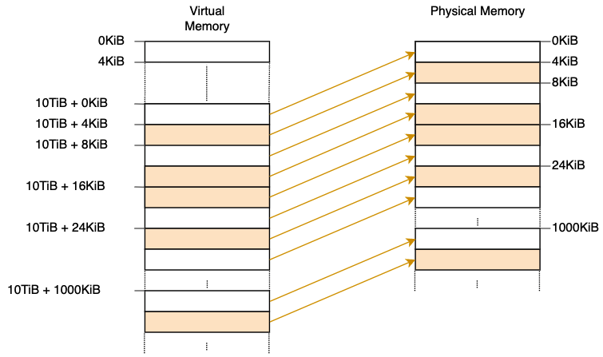
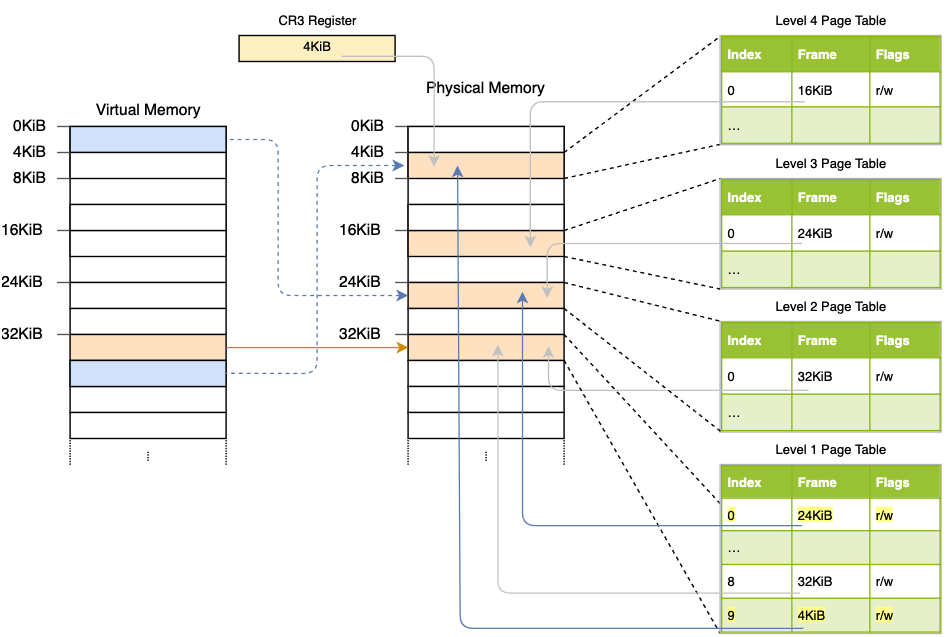

# Paging Implementation

https://os.phil-opp.com/paging-implementation/

## Accessing Page Tables

There are different ways to create these mappings that all allow us to access arbitrary page table frames

- Identity Mapping

  会产生 segmentation.

  虚拟地址空间也会被消耗

- Map at a Fixed Offset

  和 Identity Mapping 有同样的问题

- Map the Complete Physical Memory
  
- Temporary Mapping

  map the page tables frames only temporarily when we need to access them
  

- Recursive Page Tables

## Bootloader Support

Bootloader 会创建内核运行的页表, 使用 map_physical_memory

```
[dependencies]
bootloader = { version = "0.9.8", features = ["map_physical_memory"]}
```

bootloader 会将完整的物理内存映射到一些未使用的虚拟地址范围。

bootloader crate defines a `BootInfo` struct that contains all the information it passes to our kernel

```
  use bootloader::{BootInfo, entry_point};

  entry_point!(kernel_main);

  fn kernel_main(boot_info: &'static BootInfo) -> ! {
      […]
  }
```

用 entry_point Macro 生成 entry point, bootloader 会调用这个 entry point

```
  // in src/main.rs

  use bootloader::{BootInfo, entry_point};

  entry_point!(kernel_main);

  fn kernel_main(boot_info: &'static BootInfo) -> ! {
      […]
  }
```

## Implementation
