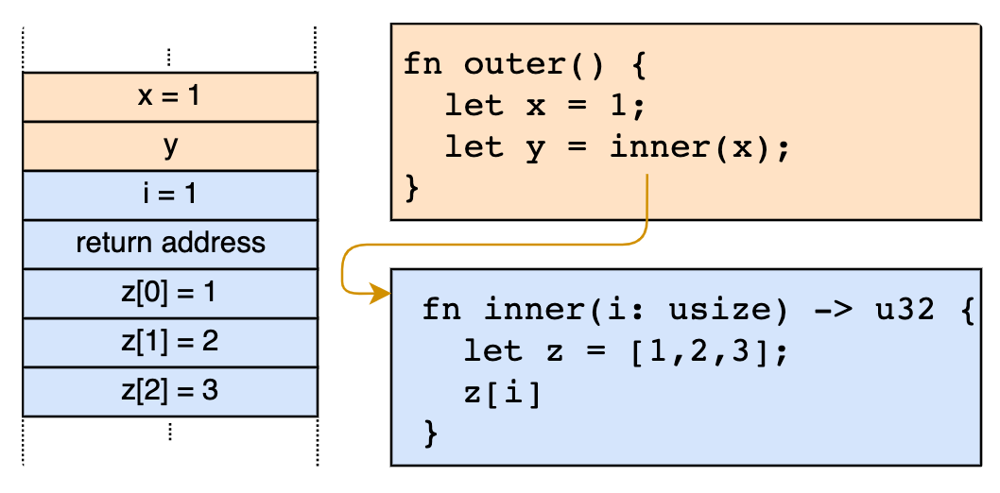
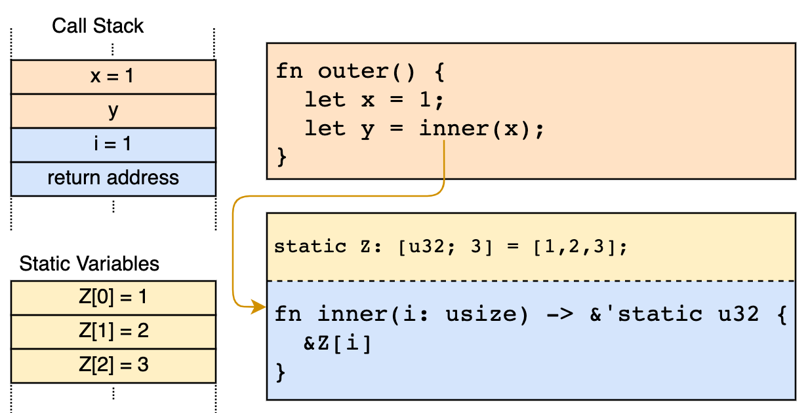
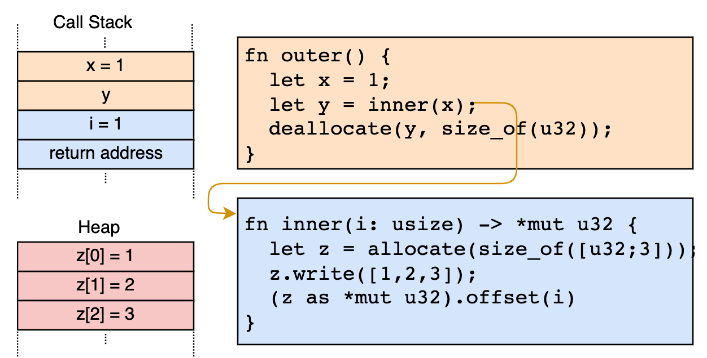

# Heap Allocation

https://os.phil-opp.com/heap-allocation/

## Local and Static Variables

Local variables are stored on the call stack


Static variables are stored at a fixed memory location separate from the stack.

Statics live for the complete runtime of the program

## Dynamic Memory

- Local variables only live until the end of the surrounding function or block. This is because they live on the call stack and are destroyed after the surrounding function returns.

- Static variables always live for the complete runtime of the program, so there is no way to reclaim and reuse their memory when they’re no longer needed. Also, they have unclear ownership semantics and are accessible from all functions, so they need to be protected by a Mutex when we want to modify them.

  

## Common Errors

- use-after-free vulnerability
- double-free vulnerability

## The Allocator Interface

使用 rust standard lib 自带的 alloc create

```
// in src/lib.rs

extern crate alloc;
```

```
// in src/lib.rs

#![feature(alloc_error_handler)] // at the top of the file

#[alloc_error_handler]
fn alloc_error_handler(layout: alloc::alloc::Layout) -> ! {
    panic!("allocation error: {:?}", layout)
}
```

在 .cargo/config.toml 中加入 alloc
Since we are compiling for a custom target, we can’t use the precompiled version of alloc that is shipped with the Rust installation. Instead, we have to tell cargo to recompile the crate from source.

```
[unstable]
build-std = ["core", "compiler_builtins", "alloc"]
```

使用

```
// in src/main.rs

extern crate alloc;

use alloc::boxed::Box;

fn kernel_main(boot_info: &'static BootInfo) -> ! {
    // […] print "Hello World!", call `init`, create `mapper` and `frame_allocator`

    let x = Box::new(41);

    // […] call `test_main` in test mode

    println!("It did not crash!");
    blog_os::hlt_loop();
}
```

## Creating a Kernel Heap

```
// in src/allocator.rs

pub const HEAP_START: usize = 0x_4444_4444_0000;
pub const HEAP_SIZE: usize = 100 * 1024; // 100 KiB
```

## Using an Allocator Crate

```
# in Cargo.toml

[dependencies]
linked_list_allocator = "0.9.0"
```

```
// in src/allocator.rs

use linked_list_allocator::LockedHeap;

#[global_allocator]
static ALLOCATOR: LockedHeap = LockedHeap::empty();
```
